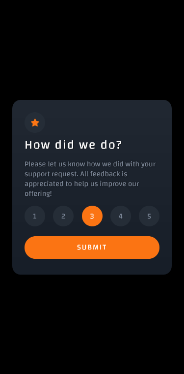
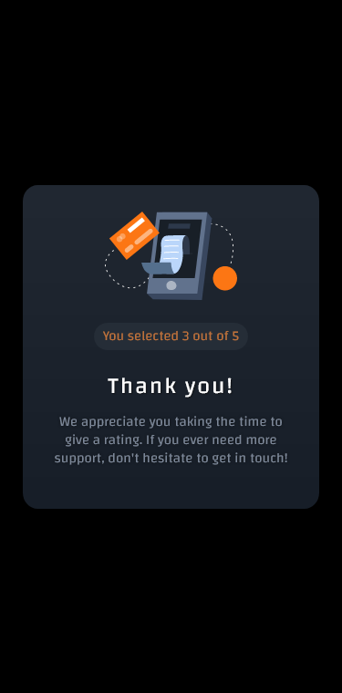

# Frontend Mentor - Interactive rating component solution

This is a solution to the [Interactive rating component challenge on Frontend Mentor](https://www.frontendmentor.io/challenges/interactive-rating-component-koxpeBUmI). Frontend Mentor challenges help you improve your coding skills by building realistic projects. 

## Table of contents

- [Overview](#overview)
  - [The challenge](#the-challenge)
  - [Screenshot](#screenshot)
  - [Links](#links)
- [My process](#my-process)
  - [Built with](#built-with)
  - [What I learned](#what-i-learned)
  - [Continued development](#continued-development)
- [Author](#author)

## Overview

### The challenge

Users should be able to:

- [X] View the optimal layout for the app depending on their device's screen size
- [X] See hover states for all interactive elements on the page
- [X] Select and submit a number rating
- [X] See the "Thank you" card state after submitting a rating

### Screenshot

Desktop Front           |  Desktop Back
:-------------------------:|:-------------------------:
  |  
  |  


### Links

- Solution URL: [REPO](https://github.com/christophermorin/frontend-mentor/tree/main/interactive-rating-component-main)
- Live Site URL: [Live Site](https://cm-interactive-rating-component.netlify.app/)

## My process

### Built with

- Semantic HTML5 markup
- CSS custom properties
- Custom Javascript
- Flexbox
- Mobile-first workflow

### What I learned

The JS for the rank selection was quite fun and good practice for event listeners. Something I definitely need to work on.

```
rankChoice.addEventListener('click', (e) => {
    // Removes all styles on rank selections to avoid multiple ranks being selected at once.
    removeAllSelections()
    // If current target is an LI add selection styles and place li text value into stars
    if(e.target.tagName == 'LI') {
        e.target.classList.add('setChoice')
        stars = e.target.innerText
        rankSubmitted.innerText = `You selected ${stars} out of 5`
    }
})
```

### Continued development

Spacing between elements, and once again a better understanding of Flexbox. Or, trying out CSS Grid next time.

## Author

- Website - [Chris Morin](https://chrismorin.netlify.app)
- Frontend Mentor - [@christophermorin](https://www.frontendmentor.io/profile/christophermorin)
- Twitter - [@longhumans](https://www.twitter.com/longhumans)
