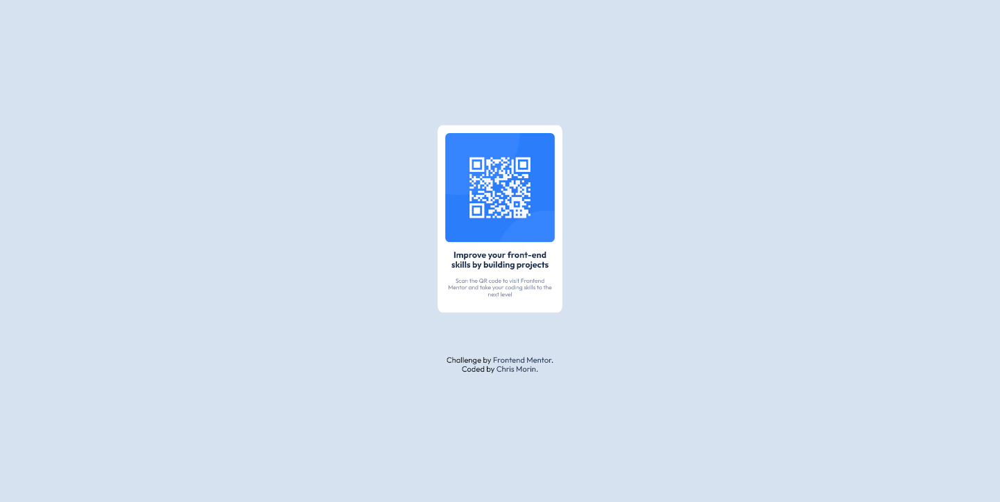

# Frontend Mentor - QR code component solution

This is a solution to the [QR code component challenge on Frontend Mentor](https://www.frontendmentor.io/challenges/qr-code-component-iux_sIO_H). Frontend Mentor challenges help you improve your coding skills by building realistic projects. 

## Table of contents

- [Overview](#overview)
  - [Screenshot](#screenshot)
  - [Links](#links)
- [My process](#my-process)
  - [Built with](#built-with)
  - [What I learned](#what-i-learned)
  - [Continued development](#continued-development)
- [Author](#author)

## Overview

### Screenshot

Desktop            |  Mobile
:-------------------------:|:-------------------------:
  |  

### Links

- Solution URL: [Repo](https://github.com/christophermorin/frontend-mentor/tree/main/qr-code-component-main)
- Live Site URL: [Live Site](https://cm-qr-code.netlify.app/)

## My process

### Built with

- Semantic HTML5 markup
- CSS custom properties
- Flexbox
- Mobile-first workflow

### What I learned

I am familiar enough with HTML and CSS to have completed this with few issues but this was the first time building something from a premade example and trying to match it exactly. Choosing pixel sizes was to match was the most difficult part of the project.

### Continued development

Calculating exact pixel sizes is something I need to work on more.

## Author

- Website - [Chris Morin](https://chrismorin.netlify.app/)
- Frontend Mentor - [@christophermorin](https://www.frontendmentor.io/profile/christophermorin)
- Twitter - [@longhumans](https://twitter.com/longhumans)
- Gitbuh - [GitHub](https://github.com/christophermorin)
- LinkedIn [LinkedIn](https://www.linkedin.com/in/chrisjmorin/)
